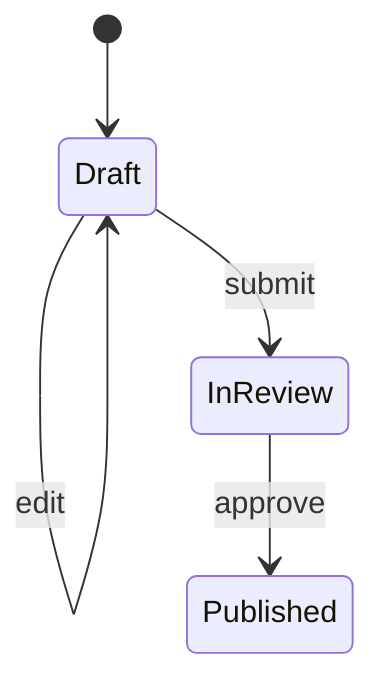
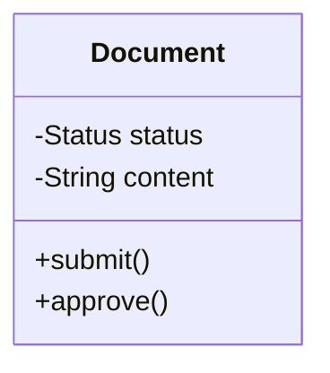
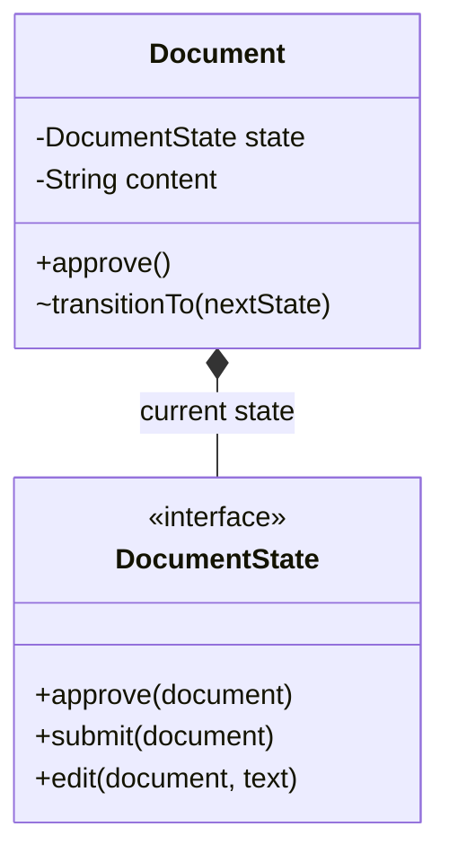
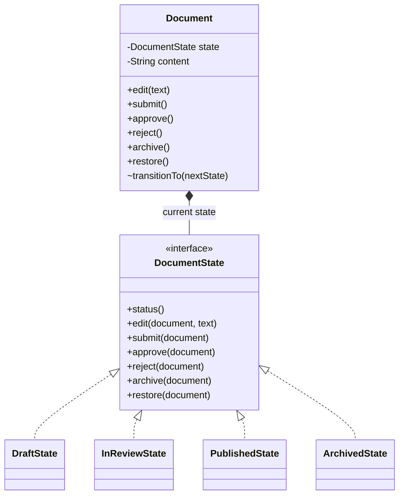
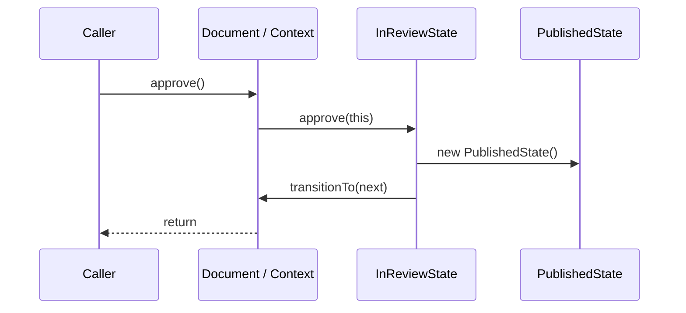

# Understanding the State pattern from scratch

Imagine you are building a small publishing tool. A writer creates a document, edits it, submits it for review, and a reviewer approves it. Later, someone asks for an archive feature.

You could build that without knowing any design patterns. In fact, you *should* begin with the plain version. We will do that here, watch a real change expose a weakness, and only then introduce the State pattern. By the end, the class diagram should feel like a description of decisions we made, rather than a diagram you have to memorise.

This guide assumes no knowledge of the publishing project or the State pattern. We will build the example here first; a runnable Java repository and its tagged history appear near the end.

## A document is one object, but it does not always behave the same way

Suppose we create a document with some text. At first it is a **Draft**. Editing it is fine. Once it has been **submitted for review**, editing should stop; otherwise the reviewer might approve text they never saw. Approval moves it to **Published**.

We already have three useful words:

- A **state** is the document's current situation, such as Draft or In Review.
- An **action** is a request, such as `edit`, `submit`, or `approve`.
- A **transition** is a move from one state to another, such as Draft → In Review.

The distinction matters because an action need not cause a transition. Editing changes the text while the document stays in Draft. Approval changes the state. An invalid request, such as approving a Draft, should follow whatever error policy the product chooses. In this project, we throw `IllegalStateException` and leave the document unchanged.

Here is the first, small rule set:



Read an arrow as “when this action occurs in this state, the document ends in that state.” The diagram shows valid behavior. It does not yet show what happens when someone calls `approve()` on a Draft.

### The simple Java version

Java's `enum` gives us a fixed set of names for the current status:

```java
public final class Document {
    public enum Status { DRAFT, IN_REVIEW, PUBLISHED }

    private String content;
    private Status status = Status.DRAFT;

    public Document(String content) {
        this.content = content;
    }

    public Status status() {
        return status;
    }

    public void submit() {
        if (status != Status.DRAFT) {
            throw new IllegalStateException("Only a draft can be submitted");
        }
        status = Status.IN_REVIEW;
    }

    public void approve() {
        if (status != Status.IN_REVIEW) {
            throw new IllegalStateException("Only a document in review can be approved");
        }
        status = Status.PUBLISHED;
    }
}
```

Take a moment to follow `submit()`. The method checks a precondition: the document must currently be a Draft. If that is true, it changes `status` to In Review. `approve()` does the same kind of work for the next transition.

**There is no design problem here yet.** The checks are short, the rules are visible, and one class is easier to understand than several classes. The State pattern would add machinery without earning it. This is why “replace every `if` with a pattern” is poor advice.

You may have noticed that `submit()` both checks the current status and changes it. That is normal. A workflow action must make its transition somewhere. The later design still changes the document's state; it simply puts the decision about *which transition is allowed* somewhere else.

## Let the product grow before judging the design

Now add two requests. A writer can `edit(text)` while the document is a Draft. A reviewer can `reject()` a document in review, returning it to Draft for more work.

One way to implement those rules is to continue adding methods to `Document`:

```java
public void edit(String newContent) {
    if (status == Status.DRAFT) {
        content = newContent;
    } else if (status == Status.IN_REVIEW) {
        throw new IllegalStateException("A document in review cannot be edited");
    } else if (status == Status.PUBLISHED) {
        throw new IllegalStateException("A published document cannot be edited");
    }
}

public void reject() {
    if (status == Status.DRAFT) {
        throw new IllegalStateException("A draft is not in review");
    } else if (status == Status.IN_REVIEW) {
        status = Status.DRAFT;
    } else if (status == Status.PUBLISHED) {
        throw new IllegalStateException("A published document cannot be rejected");
    }
}
```

The code still works for the three known states. But compare the methods. `submit()` asks “is this Draft?” and rejects everything else. `edit()` and `reject()` name each state separately. Each method now owns a slice of the same workflow policy.

What would you read if someone asked, “What can a Published document do?” You would inspect `edit`, `submit`, `approve`, `reject`, and any later methods. The answer is distributed across methods rather than located in one place.

### A change request: add Archived

Published documents must now be archived, and an archived document can be restored to Draft. We add `ARCHIVED` to the enum and introduce `archive()` and `restore()`. The complete intended rules are:

| Action | Draft | In Review | Published | Archived |
| --- | --- | --- | --- | --- |
| `edit(text)` | Change text; stay Draft | Error | Error | Error |
| `submit()` | Go to In Review | Error | Error | Error |
| `approve()` | Error | Go to Published | Error | Error |
| `reject()` | Error | Go to Draft | Error | Error |
| `archive()` | Error | Error | Go to Archived | Error |
| `restore()` | Error | Error | Error | Go to Draft |

This table is a statement of **our product requirements**. Four states multiplied by six actions gives 24 combinations we need to account for. Most are errors in this product, but the State pattern does not require an allow/deny policy. A media player might treat `play()` while already playing as a harmless no-op. The pattern concerns how current state affects behavior, whatever that behavior is.

Here is the mistake made in the intentionally broken project version: `ARCHIVED` exists, but `edit()` and `reject()` still list only the old states. Consider an archived document passed to `edit()`. The Draft condition is false. The In Review condition is false. The Published condition is false. Execution reaches the closing brace. In Java, a `void` method can then return normally.

So editing an archived document does **not** change the text, but it also does **not** signal that the operation is forbidden. The caller sees a normal return. `reject()` has the same gap. A test that expects an exception catches the mistake:

```java
document.archive();
expectInvalid(() -> document.edit("This must be rejected"));
```

The test fails because no `IllegalStateException` was thrown. This is more persuasive than saying the class “looks messy”: a new state led to an observable behavior bug.

Could we repair it without the State pattern? Certainly. Add an Archived branch, or a final `else` that always throws. That is what the next project commit does. The repaired version passes its tests. We now have a better question than “Can we fix the bug?” We can. The question is: **as this workflow continues to change, where will engineers look, and how many places must they remember to check?**

## What design principles actually tell us

Design principles are useful when they explain a concrete maintenance cost. They are less useful as labels to attach to any code we dislike.

### Open/Closed Principle: how far does one change spread?

The Open/Closed Principle asks us to design code that can accommodate likely extensions without repeatedly rewriting established behavior. That does not mean “never edit an existing file.” It asks us to pay attention to the *radius of a change*.

When Archived arrived, we added an enum value and new actions. We also had to examine every existing action to decide what Archived meant there. Some methods already rejected it through a catch-all guard. Two methods enumerated the older states and missed it. The new feature sent us back through old code, and one missed decision changed behavior.

This is the particular Open/Closed pressure in our example: state-rule changes spread through action methods. A design that gives Archived's own rules a clear home may reduce that spread. It will not make future changes free; we will examine its limits later.

### Single Responsibility Principle: what reasons change this class?

A practical reading of the Single Responsibility Principle is that a class should have one coherent reason to change. Here `Document` holds title and content, exposes document operations, and increasingly contains the policy for every stage of publishing. A change to how content is stored is different from a change to review or archive rules.

At the small three-state stage, keeping those together was reasonable. As workflow policy grows, the class becomes a meeting point for several kinds of change. Call this **pressure on its responsibility boundary**, rather than claiming that every multi-purpose class is automatically broken.

### Encapsulate what varies: which knowledge moved?

The changing knowledge is not “the state variable” alone. It is the **behavior associated with each current state**: what actions are valid, what they do, what they reject, and which state comes next.

In the conditional version, that knowledge is spread across methods organised by action. To know the complete rule for Archived, you search several methods. The refactor will group state-dependent behavior into classes organised by state. That makes the location of a state-rule change more predictable.

There is also duplicated *knowledge* of the state set, even where no identical lines of code are copied. That is more precise than saying “we violated DRY because there are many `if` statements.”

### Keep the diagnosis honest

Changing status in `submit()` is not itself a violation. Nor does an `if` statement violate a principle. The observed issue is that the workflow's rules are distributed across methods, and the Archived change exposed a gap. We should choose a pattern only if its extra structure makes likely future changes safer to understand and implement.

## Deriving the State pattern, one decision at a time

We know the failure we want to prevent. We have not yet decided that an interface is necessary. Let us earn each piece of the design.

### Why organise by state?

The old `Document` is organised **by action**. `edit()` contains rules for Draft, In Review, Published, and Archived; `reject()` contains another set of rules for those same states. A new state made us reconsider multiple action methods.

We can turn the rule table the other way around. Put everything a Draft can do in `DraftState`, everything an In Review document can do in `InReviewState`, and so on. The caller still talks to one `Document`. The internal code is now organised around **current state**.

This choice follows our observed change. Archived was a new state whose rules spread across methods. It does not mean actions never change. Adding a new action such as `schedule()` will be more expensive in this design because the common State contract must grow. The pattern makes one dimension of change easier at a cost to another.

### Why does Document need a State field?

We want callers to keep writing `document.approve()`. They should not have to choose a concrete state class themselves. So `Document` receives the request and delegates its state-dependent behavior:

```java
private DocumentState state = new DraftState();

public void approve() {
    state.approve(this);
}
```

`Document` is called the **Context** in pattern terminology. It owns the document data and a reference to its current State object. The calling code is the **client**. Passing `this` gives the state object controlled access to the current Context so it can request a transition.

Why not declare the field as `DraftState`? Because after submission it must hold an `InReviewState`. A field typed as one concrete class cannot hold an unrelated concrete class. We need a common type.

### Why make that common type an interface?

A Java interface describes a **contract of operations**. Both `DraftState` and `InReviewState` can implement `DocumentState`, allowing `Document` to call `state.approve(this)` without asking which class it holds. Java dispatches that call to the current object's implementation at runtime. That is polymorphism.

We choose an interface here because the states share an operation contract but do not need shared mutable fields. An abstract base class is also a valid State abstraction in other designs.

Here is the shape used in our project:

```java
interface DocumentState {
    Document.Status status();

    default void edit(Document document, String newContent) {
        throw new IllegalStateException("Cannot edit a document in " + status());
    }

    default void submit(Document document) {
        throw new IllegalStateException("Cannot submit a document in " + status());
    }

    default void approve(Document document) {
        throw new IllegalStateException("Cannot approve a document in " + status());
    }

    default void reject(Document document) {
        throw new IllegalStateException("Cannot reject a document in " + status());
    }

    default void archive(Document document) {
        throw new IllegalStateException("Cannot archive a document in " + status());
    }

    default void restore(Document document) {
        throw new IllegalStateException("Cannot restore a document in " + status());
    }
}
```

The important decision here is the **default**: an action is rejected unless a Concrete State overrides it. That matches our product rule. It prevents the old silent return, but it does not replace testing. If we forget to override an action that *should* be allowed, the method will reject it incorrectly.

“Explicit allow, default deny” is a choice in this project, not the definition of State. Other products may make a repeated action harmless or return a result instead of throwing.

### Build one Concrete State

Draft permits editing and submitting. Its class expresses those two behaviors directly:

```java
final class DraftState implements DocumentState {
    @Override public Document.Status status() {
        return Document.Status.DRAFT;
    }

    @Override public void edit(Document document, String text) {
        document.replaceContent(text);
    }

    @Override public void submit(Document document) {
        document.transitionTo(new InReviewState());
    }
}
```

There is no `if (status == DRAFT)` in `DraftState`. We already know which behavior is active because `Document` currently holds a `DraftState` object. Editing changes content but keeps that object. Submitting replaces it with an `InReviewState` object.

In Review permits approval and rejection:

```java
final class InReviewState implements DocumentState {
    @Override public Document.Status status() {
        return Document.Status.IN_REVIEW;
    }

    @Override public void approve(Document document) {
        document.transitionTo(new PublishedState());
    }

    @Override public void reject(Document document) {
        document.transitionTo(new DraftState());
    }
}
```

The remaining classes are small. Published can be archived, and Archived can be restored:

```java
final class PublishedState implements DocumentState {
    @Override public Document.Status status() {
        return Document.Status.PUBLISHED;
    }

    @Override public void archive(Document document) {
        document.transitionTo(new ArchivedState());
    }
}

final class ArchivedState implements DocumentState {
    @Override public Document.Status status() {
        return Document.Status.ARCHIVED;
    }

    @Override public void restore(Document document) {
        document.transitionTo(new DraftState());
    }
}
```

They inherit the interface's rejecting behavior for other actions.

### What remains in Document?

The Context still owns the title and content. It holds the active State object and delegates its actions. This is the essence of the finished `Document`:

```java
public final class Document {
    public enum Status { DRAFT, IN_REVIEW, PUBLISHED, ARCHIVED }

    private final String title;
    private String content;
    private DocumentState state = new DraftState();

    public Document(String title, String content) {
        this.title = title;
        this.content = content;
    }

    public String title() { return title; }
    public String content() { return content; }
    public Status status() { return state.status(); }

    void transitionTo(DocumentState next) { state = next; }
    void replaceContent(String text) { content = text; }

    public void edit(String text) { state.edit(this, text); }
    public void submit() { state.submit(this); }
    public void approve() { state.approve(this); }
    public void reject() { state.reject(this); }
    public void archive() { state.archive(this); }
    public void restore() { state.restore(this); }
}
```

The short public methods are not the goal by themselves. Their significance is that `Document` no longer decides what every state means inside each action. The detailed rule has moved to the relevant Concrete State.

The `Status` enum remains as a **label** returned to callers and tests. The active `DocumentState` object controls behavior. We do not keep a second mutable status field that could disagree with the object.

### Connect the Java ideas

| Idea | What it means | This project's evidence |
| --- | --- | --- |
| Interface | A common operation contract | `DocumentState` declares actions the Context can delegate |
| Composition | One object holds and uses another | `Document` holds a `DocumentState state` field |
| Polymorphism | The same call reaches behavior chosen by the object's concrete type | `state.approve(this)` reaches `InReviewState.approve` when In Review is active |

These ideas make the design possible. The **State pattern** is the particular use of them to represent state-dependent behavior and transitions.

## Build the UML alongside the code

A UML diagram is a map of classes and relationships. We can draw it in the same sequence as our design decisions.

Initially, one class holds a status value and action methods:



After extraction, the Context holds a reference to the State abstraction. This is the relationship we needed for delegation:



Finally, add the classes implementing the interface:



Read `DocumentState <|.. DraftState` as “DraftState implements DocumentState.” The `*--` relationship indicates that Document owns its current State object in this implementation. If many contexts shared immutable State objects, a plain association might describe that variant more precisely. In a UML class box, `+` means public, `-` means private, and `~` means package-private.

The diagram shows **structure**. It does not show the order of calls. Let us trace an action to see that order.

## Follow one call from the client to the next state

Suppose a caller has a document that has already been submitted for review:

```java
Document document = new Document("Release notes", "First draft");
document.submit();
document.approve();
System.out.println(document.status()); // PUBLISHED
```

What happens on the third line? The caller invokes `Document.approve()`. The Context invokes `state.approve(this)`. Its current `state` reference holds an `InReviewState`, so Java calls `InReviewState.approve(document)`. That method asks the Context to replace its state with a new `PublishedState`. The Context object is still the same document; its internal State object has changed.



Now imagine the caller invokes `document.approve()` a second time. The public method in `Document` has not changed, but its `state` field now holds `PublishedState`. That class does not override approval, so `DocumentState`'s default method throws. **The same public call behaves differently because the current State object is different.** That sentence is the heart of the pattern.

The current Concrete State chooses the next Concrete State in our code. Another implementation might put transition selection in the Context, a factory, or a transition table. The pattern's essential relationship is that the Context delegates state-dependent behavior to a replaceable State object.

We can now give the pattern a compact definition:

> The State pattern lets an object vary its behavior with its current state by delegating state-dependent work to an object representing that state.

Notice what the definition does *not* say. It does not require exceptions for invalid actions. It does not require every action to cause a transition. It does not say a state is merely an enum value. It does not guarantee fewer files or faster execution.

## Does the new design actually solve our problem?

It gives us a better place to look. If editing rules in Draft change, start with `DraftState`. If approval rules in review change, start with `InReviewState`. The Context's action methods no longer each contain a cross-state decision. A new state can define most of its own behavior in a new class.

But be careful with the word “most.” Suppose rejection should now lead to a new **Changes Requested** state. `InReviewState.reject()` must change because it currently constructs `DraftState`. The new state needs its own class, label, tests, and perhaps a persistence mapping. The State pattern reduces one kind of change spread; it does not make all changes additive.

It also introduces real costs:

- We now navigate between the Context, interface, and Concrete States to follow one call.
- The State interface contains every action, even though most states allow only a few. Default methods reduce boilerplate but could conceal a missing override until tested.
- Concrete States know about their destination states. That transition coupling is intentional in this small workflow, but a larger system may want a different transition owner.
- Adding a new action touches the public Context API, the interface, one or more Concrete States, and tests.
- State objects do not make the document thread-safe, persistent, or transactional. Those are separate responsibilities.

Would I use State for the first three-state, two-action version? Probably not. The original guards are clearer. Would I consider it once actions, states, and state-specific rules keep growing? Yes—especially after a change like Archived caused a missed rule.

A useful decision test is: **When someone asks for a new rule, can the team predict where to implement and review it?** If a small switch answers that well, keep the switch. If the team repeatedly hunts through many methods for state rules, State may earn its extra structure.

### Other representations can be better

A finite-state machine is the *model* of states and transitions. The GoF State pattern is one object-oriented *implementation* of state-dependent behavior. They are related but not identical.

A transition table can be attractive if the rules are mostly data and need to be generated, inspected, or configured. A workflow engine can be appropriate when processes wait for external services, retry, and persist across machines. An enum and guarded methods remain a sound choice for a small stable workflow.

State can also resemble Strategy because both use an object behind an interface. With Strategy, a caller often selects an interchangeable algorithm. With State, behavior follows the Context's current lifecycle, and states often initiate transitions. The class diagrams may look similar; the reason for changing behavior is different.

## See the same kind of problem outside our document

Consider a media player. Calling `play()` while stopped might start playback; while paused it might resume; while already playing it might do nothing. The same action can have different valid responses in different states. This shows why “State means explicitly allow some combinations and deny the rest” is too narrow.

Android's [MediaPlayer API reference](https://developer.android.com/reference/android/media/MediaPlayer) publishes a state diagram and a table of valid and invalid method states. Its [state-management guide](https://developer.android.com/media/platform/mediaplayer/state-resources) explains why calling operations in the wrong state causes bugs. These official documents establish a real **state-dependent API problem**. They do not establish that MediaPlayer's private implementation uses the exact Java class structure we built here.

[AWS Step Functions](https://docs.aws.amazon.com/step-functions/latest/dg/concepts-statemachines.html) is another useful comparison. It expresses workflows as state machines with tasks and flow-control states. It solves a different scale of problem from our in-process `Document` objects. It is an example of explicit states and transitions, not evidence that the service internally implements this GoF pattern.

If you want a second teaching implementation, [Refactoring.Guru's State article](https://refactoring.guru/design-patterns/state) uses a media-player example and shows the generic Context, State, and Concrete State structure. Compare its diagram with the classes we derived. Ask what its State objects are responsible for and who triggers transitions.

## Read the runnable project after the explanation

The [public Java repository](https://github.com/dikshant-dwivedi/state-pattern-document-workflow) records the evolution in small commits. You can understand this guide without opening it. When you do open it, use the history to test whether the design reasoning matches actual code rather than reading only the final version.

| Stop | Open these files | What you should observe |
| --- | --- | --- |
| [`01-small-workflow`](https://github.com/dikshant-dwivedi/state-pattern-document-workflow/tree/01-small-workflow) | `Document.java`, then `DocumentTest.java` | Two guards are enough for the early workflow. |
| [`02-growing-conditionals`](https://github.com/dikshant-dwivedi/state-pattern-document-workflow/tree/02-growing-conditionals) | `Document.edit` and `Document.reject` | More methods know the same state set. |
| [`03-archived-bug`](https://github.com/dikshant-dwivedi/state-pattern-document-workflow/tree/03-archived-bug) | Enum, `edit`, `reject`, test | Archived has no matching branch in two methods; the test intentionally fails. |
| [`before-state-pattern`](https://github.com/dikshant-dwivedi/state-pattern-document-workflow/tree/before-state-pattern) | Repaired `Document` | Two new branches make tests pass; rules remain distributed. |
| [`05-first-delegation`](https://github.com/dikshant-dwivedi/state-pattern-document-workflow/tree/05-first-delegation) | `DocumentState`, `DraftState`, `Document.edit` | The first action is delegated; other actions still use conditionals. |
| [`06-review-transitions`](https://github.com/dikshant-dwivedi/state-pattern-document-workflow/tree/06-review-transitions) | `DraftState`, `InReviewState` | Submit, approve, and reject move to Concrete States. |
| [`after-state-pattern`](https://github.com/dikshant-dwivedi/state-pattern-document-workflow/tree/after-state-pattern) | `PublishedState`, `ArchivedState`, `Document` | Every action delegates; the same rules are organised by state. |
| [`main`](https://github.com/dikshant-dwivedi/state-pattern-document-workflow) | `Demo.java`, `DocumentTest.java` | The demo shows transitions and the tests cover invalid actions. |

With Java 17 installed, run the test script at each tag. The historical tags through step 07 also call `rg`, so install ripgrep for those tags if it is absent. The final `main` script uses standard shell tools.

```bash
git clone https://github.com/dikshant-dwivedi/state-pattern-document-workflow.git
cd state-pattern-document-workflow
git switch --detach 03-archived-bug
bash scripts/test.sh                    # intentionally fails
git switch --detach before-state-pattern
bash scripts/test.sh                    # passes
git diff before-state-pattern after-state-pattern -- src/main/java
git switch main
bash scripts/demo.sh
```

Detached checkout is useful for reading a historical tag. Switch back to `main` before starting an exercise branch.

## Frequently asked questions

**Is the Context the code that creates the document?** No. `Document` is the Context: the object callers use and the owner of the current State reference. Code that constructs or calls it is the client.

**Why keep the `Status` enum after introducing State objects?** It provides a readable label for inspection and tests. The active State object, rather than the enum, determines behavior. The final Context does not maintain two independently mutable representations.

**Must every action change the State object?** No. Editing Draft changes content but keeps Draft. An action may also return data, do nothing by policy, or fail.

**Must invalid actions throw?** No. That is our chosen business contract. Another product might return an error value, ignore an idempotent request, or enter an Error state.

**Do we need one State object per document?** Not always. Stateless immutable State objects can sometimes be shared. Our project creates small objects to make transitions easy to read. Sharing is more complicated if a State stores a reference to a particular Context or mutable data.

**Why pass `Document` into each State method?** A State may need to read or change Context-owned data and request a transition. Some State implementations instead store a Context reference when constructed. Either arrangement can implement the same pattern.

**Does adding a new state require only one class?** Usually not. Existing states may need to transition into it, and labels, tests, saved data, and documentation may need updates. The improvement is that its own behavior has a predictable home.

**Does this comply perfectly with the Open/Closed Principle?** No design is magically closed to all changes. State reduces modification pressure for many state-rule changes. New actions and changed incoming transitions still affect existing code.

**Does a State object replace domain data in the Context?** No. `Document` still owns title and content. State objects own the state-specific decision rules.

**Does State make concurrent calls safe?** No. Two threads could race while changing content or the current State. Synchronisation or transactional design is separate.

**How would we store documents in a database?** Store a stable state identifier and domain data, then reconstruct the corresponding State object when loading. Think through versioning if states or transitions are renamed later.

## Exercises — no hints or solutions

Each exercise stands on its own. Create a branch from `main` for each one. Update the rule table and state diagram to reflect the requirement, then implement the code and tests. The acceptance checks specify *observable behavior*, not an implementation recipe.

### Exercise 1: add an action

A reviewer can withdraw a document from In Review, returning it to Draft. Add `withdraw()`. In Draft, Published, and Archived, withdrawal must fail without changing state or content.

**Acceptance checks:** Submit → withdraw → edit succeeds. Withdrawal from each other state throws. Existing transitions still pass their tests.

### Exercise 2: add a state

Rejection no longer returns directly to Draft. Introduce **Changes Requested**. Rejecting an In Review document enters this state. It can be edited and submitted back to In Review. It cannot be approved or archived. A new document still begins in Draft.

**Acceptance checks:** Reject → edit → submit → approve reaches Published. Every other action from Changes Requested follows the updated rule table. The demo and tests can distinguish Changes Requested from Draft.

### Exercise 3: change the invalid-action policy

Calling `archive()` on an already Archived document should succeed without changing content or state. The other archive rules stay the same.

**Acceptance checks:** Archiving twice is harmless. Archiving from Draft or In Review still fails. The rule table accurately reflects the new case.

### Exercise 4: reload a saved document

Add a loader or repository that rebuilds a document from saved title, content, and a stable status identifier. Unknown identifiers must be rejected. Do not persist a Java State object directly.

**Acceptance checks:** A loaded In Review document can be approved. A loaded Archived document can be restored and cannot be edited. An unknown identifier never produces a usable document.

### Exercise 5: choose the simpler design

Build a two-state notification toggle with `enable()`, `disable()`, and `isEnabled()`. Repeating `enable()` or `disable()` is harmless. Implement it once with an enum and guarded methods and once with State objects. Then add **Temporarily Muted** to each version. `mute()` is allowed from Enabled and enters Temporarily Muted; it fails from Disabled and is harmless when already Muted. `isEnabled()` returns false while Muted. `enable()` leaves Muted for Enabled, and `disable()` leaves Muted for Disabled.

**Acceptance checks:** Both versions have equivalent behavior tests. Write a short decision naming which design you would ship, what changed when the third state arrived, and what future change would cause you to reconsider.

## References

- [Runnable document publishing project and tagged history](https://github.com/dikshant-dwivedi/state-pattern-document-workflow)
- [Refactoring.Guru: State pattern](https://refactoring.guru/design-patterns/state)
- [Android Developers: MediaPlayer state diagram and valid method states](https://developer.android.com/reference/android/media/MediaPlayer)
- [Android Developers: managing MediaPlayer state](https://developer.android.com/media/platform/mediaplayer/state-resources)
- [AWS: Step Functions state machines](https://docs.aws.amazon.com/step-functions/latest/dg/concepts-statemachines.html)

The project is a GoF-style implementation you can run and change. The Android material shows a real state-dependent API. AWS shows a different way to express a larger state machine. Keep those claims distinct when discussing examples.
