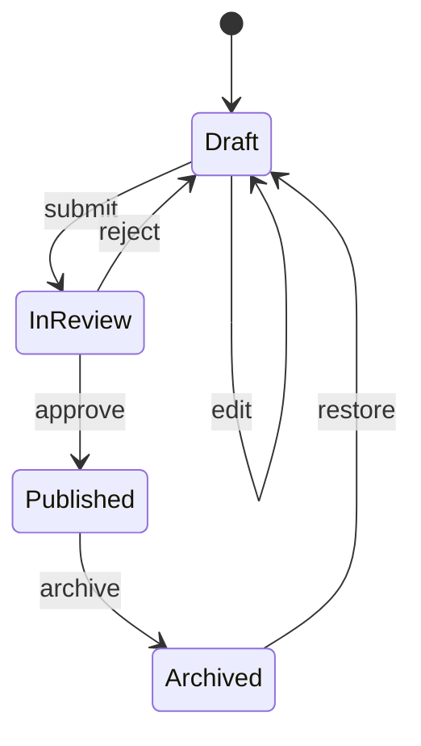
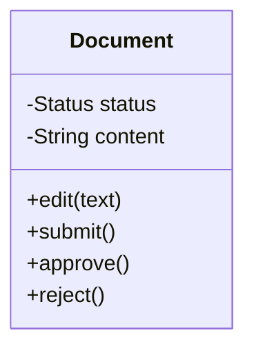
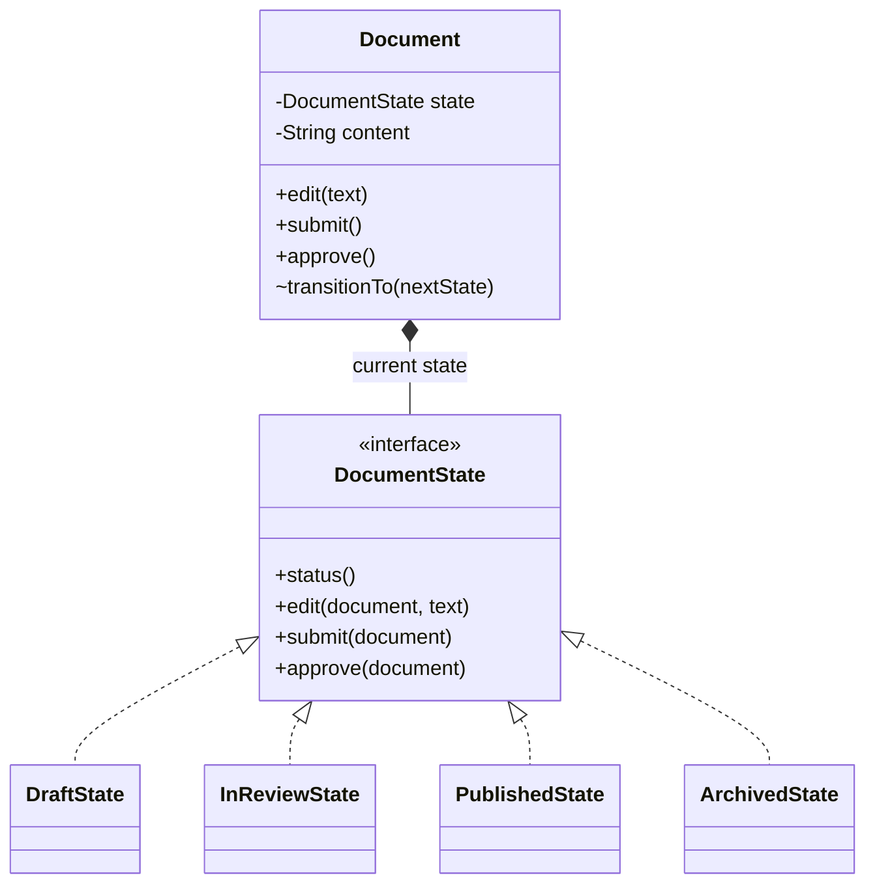
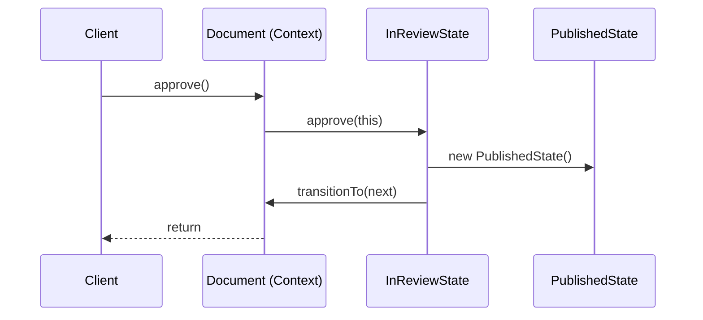

# State pattern: a document workflow, derived from the change

This guide accompanies the [document publishing repository](https://github.com/dikshant-dwivedi/state-pattern-document-workflow) and the short presentation. It develops the design from a working conditional implementation, an observed bug, and a sequence of refactors. Read the tagged code as you go. The intentionally failing commit is part of the lesson.

## What you should be able to explain

- What state, action, transition, Context, State interface, and Concrete State mean.
- Why adding Archived made the conditional implementation hard to change safely.
- Why we grouped behavior by **current state**, and why a common interface makes delegation possible.
- What the State pattern improves, what it costs, and when a simpler design is preferable.
- How the Java classes map to UML and how a caller reaches a concrete implementation.

## 1. Start with the rules, before any pattern

A **state** describes the document's current situation. An **action** is a request made to it. A **transition** is a change to the current state after an action. Not every valid action changes state: editing a Draft changes content while the document remains a Draft.

Our business rule is: an invalid action throws `IllegalStateException` and changes neither content nor state.

| Action | Draft | In Review | Published | Archived |
| --- | --- | --- | --- | --- |
| `edit(text)` | Update content; stay Draft | Error | Error | Error |
| `submit()` | Move to In Review | Error | Error | Error |
| `approve()` | Error | Move to Published | Error | Error |
| `reject()` | Error | Move to Draft | Error | Error |
| `archive()` | Error | Error | Move to Archived | Error |
| `restore()` | Error | Error | Error | Move to Draft |

There are four states and six actions, so there are 24 combinations to consider. Six are allowed in this particular workflow. **That is a product rule, not a requirement of the State pattern.** Another product might make every action valid but have it behave differently in each state, or make repeated actions harmless.



This diagram shows valid transitions. It does not show the rejected combinations. The table supplies those rules.

### The first modelling decision

Do not begin by drawing an interface. First ask: **which rules change together?** We discovered the answer by changing the workflow. Adding Archived made us revisit several action methods. That observation will motivate the design.

## 2. Walk the repository as a sequence of changes

Clone the [repository](https://github.com/dikshant-dwivedi/state-pattern-document-workflow), then use the tags in order. Run `bash scripts/test.sh` at each tag. Java 17 is required; the historical tags through step 07 also use the `rg` command in their test script.

| Tag | Files to inspect | Question to answer before continuing |
| --- | --- | --- |
| [`01-small-workflow`](https://github.com/dikshant-dwivedi/state-pattern-document-workflow/tree/01-small-workflow) | `Document.java`, `DocumentTest.java` | Are the two state guards hard to maintain yet? |
| [`02-growing-conditionals`](https://github.com/dikshant-dwivedi/state-pattern-document-workflow/tree/02-growing-conditionals) | `Document.edit` and `Document.reject` | How many methods now know about the same three states? |
| [`03-archived-bug`](https://github.com/dikshant-dwivedi/state-pattern-document-workflow/tree/03-archived-bug) | Status enum, `edit`, `reject`, new test | What happens when neither branch matches Archived? The test is expected to fail. |
| [`before-state-pattern`](https://github.com/dikshant-dwivedi/state-pattern-document-workflow/tree/before-state-pattern) | Two repaired methods | Which existing methods had to be examined for one new state? |
| [`05-first-delegation`](https://github.com/dikshant-dwivedi/state-pattern-document-workflow/tree/05-first-delegation) | `DocumentState`, `DraftState`, `Document.edit` | Follow one call across the new boundary. |
| [`06-review-transitions`](https://github.com/dikshant-dwivedi/state-pattern-document-workflow/tree/06-review-transitions) | `DraftState`, `InReviewState` | Which class now decides what approval and rejection do? |
| [`after-state-pattern`](https://github.com/dikshant-dwivedi/state-pattern-document-workflow/tree/after-state-pattern) | `PublishedState`, `ArchivedState`, `Document` | Where does each transition live? What remains in the Context? |
| [`main`](https://github.com/dikshant-dwivedi/state-pattern-document-workflow) | `Demo.java`, complete test | Check every invalid action and run the demo. |

Useful commands:

```bash
git switch --detach 03-archived-bug
bash scripts/test.sh                 # expected assertion failure
git switch --detach before-state-pattern
bash scripts/test.sh                 # passes
git diff before-state-pattern after-state-pattern -- src/main/java
git switch main
bash scripts/demo.sh
```

`git switch --detach` is appropriate for reading a historical tag. Return to `main` before making your own exercise changes.

## 3. Diagnose the conditional version precisely

At the first tag, the Context stores an enum value and checks it in two methods:

```java
private Status status = Status.DRAFT;

public void submit() {
    if (status != Status.DRAFT) {
        throw new IllegalStateException("Only a draft can be submitted");
    }
    status = Status.IN_REVIEW;
}
```

There is nothing wrong with changing `status` in `submit()`. A workflow action must make a transition somewhere. The early implementation is compact and readable.

The pressure becomes visible when `edit` and `reject` list the individual states. At the Archived step, the enum gains a new value, but those two methods still list only the old values. With no final `else`, an archived edit reaches the end of the method and returns without changing content or throwing. Rejection does the same. The test exposes the former.

The problem is more specific than “there are too many if statements”:

1. **Change radius.** One new state requires examining all actions for its valid or invalid behavior, even if only some methods need an edit.
2. **Scattered policy.** To learn everything an Archived document permits, a reader must inspect methods throughout `Document`.
3. **Inconsistent failure.** Some actions use a catch-all guard; others enumerate known states. When the state set changes, the latter can silently fall through.
4. **Review and test burden.** A reviewer needs the whole state-by-action matrix in mind. A happy-path test can miss a single invalid combination.

### Which principles are under pressure?

**Open/Closed Principle (OCP).** In practical terms, we would like to extend the workflow without repeatedly editing established methods. The Archived change required us to revisit `Document`'s actions. The bug shows the risk of that change pattern. State can reduce this pressure for state-rule changes; it does **not** guarantee zero changes to existing classes.

**Single Responsibility Principle (SRP).** A useful reading is “a class should have one coherent reason to change.” `Document` stores title and content and also accumulates workflow policy. Content-handling changes and publishing-policy changes can be different reasons to edit this class. This is design pressure, not a mathematical proof that the early class is wrong.

**Encapsulate what varies / information hiding.** The changing knowledge is how each state responds to actions. In the conditional version, that knowledge is spread through action methods. Grouping it behind a State abstraction makes the location of a state-rule change easier to predict.

**Duplication of knowledge.** The methods do not necessarily repeat identical lines. They repeat knowledge of the state set. Calling this only a “DRY violation” misses the more useful observation: a new state forces a coordinated update across multiple decisions.

Do not present “using `if` violates SOLID” as a rule. A small stable workflow may be clearer with conditionals.

## 4. Choose the organising dimension

A program can group the matrix by **action** or by **current state**:

| Organised by action | Organised by state |
| --- | --- |
| `edit()` handles all states | `DraftState` handles its actions |
| `submit()` handles all states | `InReviewState` handles its actions |
| `approve()` handles all states | `PublishedState` handles its actions |
| A new state is reconsidered across methods | A new state gets a class, plus any incoming transitions |

We chose the state axis because adding Archived was the change that spread across the existing action methods. The State pattern makes that axis explicit.

This does **not** mean actions are immutable. If we add `schedule()`, the public Context API and the State contract may need a new operation, and every state needs a policy for it. If new actions are the dominant kind of change, the interface can become broad and costly. Choose the pattern in response to observed or expected change, rather than to the mere presence of a status enum.

## 5. Derive the State structure from the code

### Step A — The Context starts alone

Initially, `Document` holds `Status` and implements all action rules. In UML, it is one class with a status attribute.



`Document` is called the **Context** because it is the object the client uses and the place where the current state is held. The client is the calling code, such as a controller or application service; the client is not the document itself.

### Step B — Give the Context one replaceable state reference

We want `Document` to delegate while its concrete state changes from Draft to In Review. The field therefore needs a **common type**:

```java
private DocumentState state = new DraftState();

public void edit(String newContent) {
    state.edit(this, newContent);
}
```

The Context **has a** State object. That is composition. The current object can be replaced during a transition. Without a common type, the Context would need type checks or separate fields for each concrete state, recreating the selection logic we are trying to relocate.

### Step C — Define the shared contract

`DocumentState` names the operations a state object can receive:

```java
interface DocumentState {
    Document.Status status();
    default void edit(Document document, String text) {
        throw new IllegalStateException("Cannot edit in " + status());
    }
    default void submit(Document document) {
        throw new IllegalStateException("Cannot submit in " + status());
    }
    // approve, reject, archive, restore follow the same shape
}
```

The repository's exact exception messages differ; this excerpt shows the structure. The interface is a **contract**, not a collection of state data. Each concrete state can be called through the same type. Java then chooses the implementation of `state.edit(...)` at runtime: polymorphism.

Our implementation uses default methods that reject actions. A concrete state overrides the actions it allows. This is a **fail-closed choice for this workflow**, not a mandatory rule of the pattern. It avoids silent fall-through, but a forgotten override could incorrectly reject a valid action. The rule matrix and tests still matter.

Why pass `Document` into a state method? The state object needs controlled access to the Context's content and transition method. Other variants store a back-reference to the Context in each state object. Neither arrangement changes the pattern's core idea.

### Step D — Implement the state-specific rules

```java
final class DraftState implements DocumentState {
    @Override public Document.Status status() { return Document.Status.DRAFT; }

    @Override public void edit(Document document, String text) {
        document.replaceContent(text);
    }

    @Override public void submit(Document document) {
        document.transitionTo(new InReviewState());
    }
}
```

`DraftState` owns what Draft does. `InReviewState` owns approve and reject; `PublishedState` owns archive; `ArchivedState` owns restore. The Context keeps document data and delegates workflow behavior.



Read the diagram alongside the code:

| Code | UML notation | Pattern role |
| --- | --- | --- |
| `private DocumentState state` | `Document *-- DocumentState` | Context holds State |
| `interface DocumentState` | `<<interface>>` | State contract |
| `DraftState implements DocumentState` | `DocumentState <|.. DraftState` | Concrete State implements contract |
| `state.submit(this)` | Delegation through the association | Runtime polymorphism |
| `transitionTo(new InReviewState())` | Current association changes target | Transition |

In the UML, `+` means public and `-` means private. The package-private transition method is shown with `~`. The enum `Status` remains in the final Java code as a label returned by `status()`; the active **state object** determines behavior.

## 6. Follow a caller through one transition

The client calls the stable public API, not a concrete state class:

```java
Document document = new Document("Release notes", "Draft text");
document.submit();
document.approve();
System.out.println(document.status()); // PUBLISHED
```

When `approve()` is called while the document is In Review, this is the runtime path:



The caller does not ask which state the document is in. `Document` does not select a branch. Java dispatches the call through the `DocumentState` interface to the implementation of the object currently stored in `state`.

The State class decides the permitted behavior and, in this implementation, chooses the next State object. `Document.transitionTo` performs the replacement. A different implementation could keep transition selection inside the Context or a separate transition table. The pattern does not prescribe one owner for every transition.

After the transition, the same call `document.approve()` would reach `PublishedState`. Since that class does not override approval, the interface's default method throws. This is why the Context appears to change its behavior without changing its Java class.

## 7. Evaluate the design rather than declaring victory

### What improved in this repository

- **Findability:** Draft-specific rules are in `DraftState`; review-specific rules are in `InReviewState`.
- **Context focus:** `Document` owns content and forwards state-dependent actions. The conditionals have left its public action methods.
- **Explicit invalid behavior:** the default methods throw instead of silently returning when a state has no override.
- **Change review:** a state-rule change starts in its Concrete State and the relevant transitions; the rule matrix and tests show the expected behavior.

### What it cost

- **More types and navigation:** an approval call crosses `Document`, `DocumentState`, `InReviewState`, and `Document.transitionTo`. A reader must follow those links.
- **A broad contract:** every state can receive every action, although most actions are invalid in most states. Default methods reduce repeated boilerplate, but can hide a missing override for a valid action until a test finds it.
- **Transition coupling:** `InReviewState` creates `PublishedState` and `DraftState`; states may know their neighbors. Adding a new state can require changes to existing source states.
- **New actions are expensive:** adding an action changes the Context API, the State contract, at least one Concrete State, and the behavior tests.
- **Runtime concerns remain:** State does not supply persistence, synchronization, transactionality, or protection against a partial side effect followed by a failed transition.

### What OCP and SRP really mean here

State often **reduces the change radius for state-specific behavior**. It does not make the whole system “closed to modification.” If a new state replaces the destination of `reject()`, `InReviewState` must change. If the public action set changes, `DocumentState` must change. State gives a useful boundary around one dimension of variation; it is not immunity from future edits.

Similarly, `Document` retaining content and a state reference is not a violation of SRP. Those are essential Context responsibilities. The improvement is that it no longer contains the detailed response policy for every state.

### Alternatives worth choosing deliberately

| Situation | A reasonable design |
| --- | --- |
| Few states and actions; rules rarely change | Enum plus guarded methods or a small switch |
| Many state rules that change independently | State objects with a shared contract |
| Rules are mostly data and need inspection or generation | Explicit transition table |
| Long-running distributed workflow with retries and external services | A workflow/state-machine engine |
| Behavior changes by a caller-selected algorithm rather than lifecycle | Consider Strategy |

A State-pattern implementation and a finite-state machine describe related things at different levels. The state diagram models legal behavior. The State pattern is one object-oriented way to implement that behavior. AWS Step Functions is a distributed workflow engine based on state machines; it is **not evidence that its internals implement this Java State pattern**.

## 8. Compare with other stateful systems

### Android MediaPlayer: an API with state-dependent operations

Android's [`MediaPlayer` API reference](https://developer.android.com/reference/android/media/MediaPlayer) publishes a state diagram and a table of methods with valid and invalid states. Its [state and resources guide](https://developer.android.com/media/platform/mediaplayer/state-resources) explains that operations in the wrong state can cause exceptions or undesirable behavior. This is a production example of the **problem domain**: a public object changes what calls are valid as it moves through a lifecycle. The public documentation does not establish which design pattern its internal implementation uses.

Compare its method/state table with our document matrix. Find an action that changes state, one that is valid without changing state, and one whose invalid use has a consequence. This comparison helps separate **business rules about state** from **a particular code structure**.

### AWS Step Functions: explicit workflow definitions

[AWS Step Functions](https://docs.aws.amazon.com/step-functions/latest/dg/concepts-statemachines.html) defines workflows as state machines in Amazon States Language. States can perform tasks, make choices, wait, or end an execution. It addresses larger, often distributed workflows. It is useful to compare with our small in-process Java design because it makes states and transitions explicit while using a different representation and runtime.

### A focused pattern reference

[Refactoring.Guru's State article](https://refactoring.guru/design-patterns/state) has a general structure diagram, a media-player example, applicability guidance, and a comparison with Strategy. Treat its examples as teaching models. Compare its generic **Context / State / Concrete State** names with the exact Java classes in this repository.

When reading any “real-world State pattern” claim, ask whether the source shows the **GoF object structure** or merely a **stateful lifecycle**. Both are interesting, but they are different claims.

## 9. Questions that often arise

**Is State just an allow/deny matrix?** No. Our default methods reject unsupported actions because that matches our rules. A valid action can change state, change data without transitioning, return a different value, or be an intentional no-op.

**Why did we create `DocumentState`?** `Document` needs one type through which it can call the current object. The interface gives all Concrete States the same callable contract and allows runtime dispatch without concrete-type checks.

**Why organise by state when actions can change too?** Archived exposed state-rule changes as the source of scattered edits. If new actions become the frequent change, the interface's breadth becomes a cost. The choice depends on the change pattern.

**Is the Context the code that creates the document?** No. `Document` is the Context. The code that constructs or calls it is the client.

**What is the difference between `Status` and `DocumentState`?** `Status` is an enum label returned for inspection. `DocumentState` is an object that supplies behavior. The final `Document` stores a `DocumentState`, not a separate mutable `Status` field.

**Is changing status inside `submit()` the original mistake?** No. The same transition happens after the refactor. The original maintenance problem was where the rules were spread and how a new state affected existing methods.

**Can the Context perform work itself?** Yes. Our Context owns content and exposes `replaceContent` and `transitionTo` for state objects to call. Delegation concerns state-specific decisions, not all work.

**Must a state change after every action?** No. `edit` keeps the document in Draft. An operation can also return a value or fail without a transition.

**Must every invalid action throw?** No. That is our chosen contract. Other APIs might return a result, ignore a repeated request, or transition to an error state. Specify the rule before choosing code.

**Who creates the next state?** In this repository, the current Concrete State does. Other State implementations may let the Context choose, use a factory, or use a transition table.

**Does a new state require only one new class?** Usually not. Incoming transitions, labels, tests, persistence mapping, and client-facing documentation may also change. The benefit is that its own behavior has a clear home.

**Could state objects be shared?** Yes, if they are immutable and carry no document-specific data. This example creates new small objects for clarity. Sharing requires care if a State object holds a Context reference or mutable data.

**Does State guarantee thread safety?** No. Concurrent calls can race on content and the current state. Synchronization or transactional boundaries are separate design decisions.

**How would we persist a document?** Persist a stable state identifier and the document data, then reconstruct the appropriate State object on loading. Think about versioning when states or transitions change.

**How is State different from Strategy?** Both use composition and polymorphism. Strategy usually represents a caller-selected way to perform a task. State represents behavior determined by the object's current lifecycle, often with transitions initiated by the states themselves. The structures can look similar; intent and transition behavior distinguish them.

**When should we not use State?** When the rule matrix is small and stable enough that guarded methods are clearer. More files are not automatically better design.

## 10. Exercises

Do each exercise on a separate branch from `main`. Update the rule matrix and state diagram before changing Java. Add tests that cover both successful behavior and rejected combinations. No solutions or hints are included here.

### Exercise 1 — Add a new action

A reviewer may withdraw a document from In Review, returning it to Draft. Add `withdraw()` to the public API. It must fail in Draft, Published, and Archived. Existing actions must preserve their current behavior.

**Completion checks:**

- A submitted document can be withdrawn and edited as Draft.
- Calling `withdraw()` from each other state throws and leaves state and content unchanged.
- The demo or tests show the complete submit → withdraw → edit path.

### Exercise 2 — Change what rejection means

A reviewer rejection no longer returns directly to Draft. Introduce **Changes Requested** as a distinct state. From In Review, `reject()` enters Changes Requested. The document can be edited there and resubmitted to In Review. It cannot be approved or archived from Changes Requested. A newly created document still starts in Draft.

**Completion checks:**

- Update the status label, diagram, and full state-by-action rule matrix.
- Test reject → edit → submit → approve.
- Test all disallowed actions in Changes Requested.
- Check whether existing transitions into Draft remain correct.

### Exercise 3 — Make one repeated action harmless

Change the business policy so calling `archive()` on an already Archived document succeeds without changing content or state. All other archive rules remain the same.

**Completion checks:**

- Test archive twice from a published document.
- Test archive from Draft and In Review still fails.
- Update the rule matrix and explain why “all non-listed combinations are errors” is no longer an accurate summary unless this case is listed.

### Exercise 4 — Recover a document from saved data

Introduce a repository or loader that reconstructs a document from a saved title, content, and status identifier. Invalid or unknown identifiers must be rejected. Do not persist a Java State object directly.

**Completion checks:**

- A loaded In Review document responds to `approve()` exactly like one that reached In Review through `submit()`.
- A loaded Archived document responds correctly to `restore()` and rejects editing.
- Unknown status identifiers cannot produce a usable document.
- Document how a future renamed or removed state would affect old saved records.

### Exercise 5 — Decide whether State is warranted

Design a separate two-state feature: a notification toggle with `enable()`, `disable()`, and `isEnabled()`. Write a conditional implementation and a State-pattern implementation. Keep both versions small.

**Completion checks:**

- Show the same behavior with tests for both versions.
- Compare files, rule locations, and the effect of adding a third state named **Temporarily Muted**.
- Write a short decision explaining which version you would ship and what future change would make you reconsider.

## Further reading and source links

- [This repository's tagged walkthrough](https://github.com/dikshant-dwivedi/state-pattern-document-workflow)
- [Refactoring.Guru — State pattern](https://refactoring.guru/design-patterns/state)
- [Android Developers — MediaPlayer API and state diagram](https://developer.android.com/reference/android/media/MediaPlayer)
- [Android Developers — managing MediaPlayer state](https://developer.android.com/media/platform/mediaplayer/state-resources)
- [AWS — state machines in Step Functions](https://docs.aws.amazon.com/step-functions/latest/dg/concepts-statemachines.html)

Use the repository as the concrete implementation, the Android documentation as a real stateful API comparison, and AWS as a contrasting workflow representation. Keep those claims separate when presenting them.
